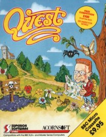

# Quest BBC Micro source reconstruction

<p align="center">
  
</p>

This repository contains a complete, byte-exact BeebAsm reconstruction of the
BBC Micro `$.QUEST1` program payload. All executable code, tables, text,
graphics, player sprites, enemy sprites, room data, and other payload bytes are
declared in the two maintained source files:

- `source_bbc/quest1.asm`
- `source_bbc/memory_map.inc`

The assembly does not include binary fragments and does not require an
original disk image or an authority payload to build.

## Requirements

- PowerShell 7 or Windows PowerShell 5.1
- [BeebAsm](https://github.com/stardot/beebasm), either on `PATH` or supplied
  with `-BeebAsm`

## Build

From the repository root:

```powershell
./build.ps1
```

Or specify the assembler explicitly:

```powershell
./build.ps1 -BeebAsm C:\path\to\beebasm.exe
```

The build writes `build/reconstruction/QUEST1` and
`build/reconstruction/quest1.labels`.

## Validate

```powershell
./validate.ps1
```

Validation performs a clean source assembly and requires the resulting payload
to be exactly `$3F20` bytes with SHA-256
`d83eadf906c83a1b1244f4ed85f34147c754ffa1ac5528738cb967185bcb528b`.
That digest is the byte-exact authority established by the reverse-engineering
project, so validation needs no copyrighted original media.

## Optional gameplay variants

The variant definitions and every tool referenced by the source comments are
included in this repository. Build first, then create a modified payload with:

```powershell
python tools/reconstruction/apply_variant.py --variant invisible_enemies
```

This writes `build/reconstruction/QUEST1-invisible_enemies`. It does not modify
the byte-exact build. To create an SSD, supply your own Quest disc image:

```powershell
python tools/reconstruction/apply_variant.py --variant invisible_enemies `
  --base-disc C:\path\to\Disc037-Quest.ssd
```

Generate a start-room definition with
`tools/reconstruction/make_start_room_variant.py`. The optional
`tools/runtime_trace/find_start_point.py` helper requires a locally installed
BeebJIT executable under `build/emulators`; it is not required to build,
validate, generate, or apply variants.

## Layout and provenance

The DFS payload loads at `$1D00`, executes at `$5C11`, and internally relocates
substantial code and data. The source preserves those addresses and uses
`COPYBLOCK`/`CLEAR` deliberately to reproduce the transport and runtime layout.
`source_bbc/reconstruction.json` records the evidence level and original address
range for each reconstructed routine and data block.

Source comments may cite evidence artifacts from the larger analysis workspace.
Those citations document how names and behavior were established and are not a
build or validation dependency. Referenced variant and start-position scripts,
however, are present here under `tools/`.

The original game, cover artwork, and other assets remain the property of their
respective copyright holders. The cover is included here for identification and
historical context. No original disk image is included here.
